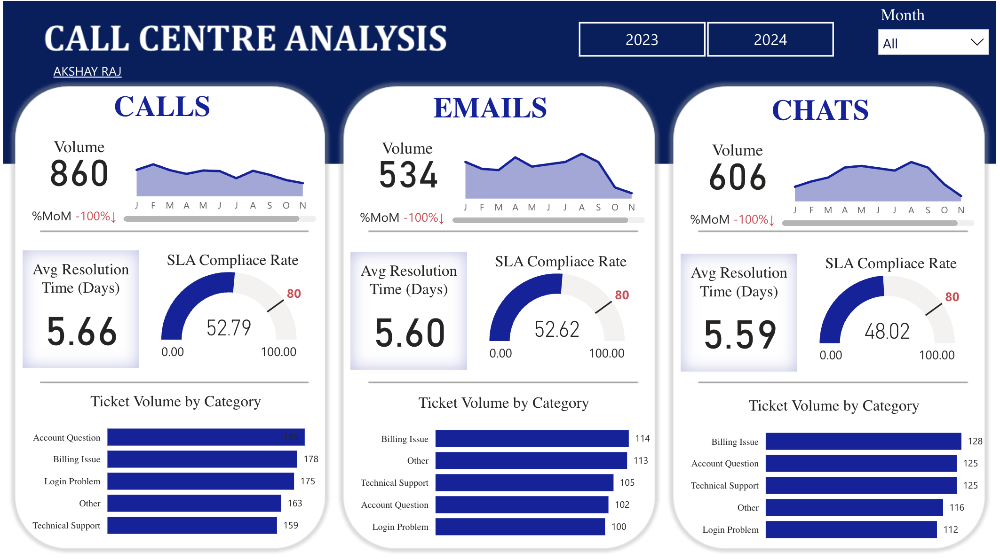

# 📞 Phone Call Centre Analysis Using SQL and PowerBI

## 📌 Project Overview

In today's fast-paced world, customer service plays a **crucial role** in maintaining a business's reputation and customer satisfaction. The **Phone Call Centre Analysis** project provides a **comprehensive evaluation** of customer interactions across different communication channels, such as **phone calls, emails, and chats**. 

The **objective** of this project is to analyze **customer service efficiency, agent performance, and ticket resolution trends** to help improve **response time, reduce SLA breaches, and optimize resource allocation**.

Using **data-driven insights and SQL analysis**, this project identifies **bottlenecks in customer service operations** and provides **actionable recommendations** to enhance customer experience.

---
## 🔗 Live Dashboard Link
## [**View Live Dashboard Here**](https://app.powerbi.com/view?r=eyJrIjoiMDcxNjA0NzktYWQxNi00NDU2LWIzYzYtNTQzM2U3YjczN2Q4IiwidCI6ImRhMDRjZDQxLTk4ZGUtNDU4YS05Zjg5LTUzNWFjODI0MWJmOSIsImMiOjJ9&pageName=2cded8ed4d2342e7f441)

## 📊 Key Business Problems Addressed

### **1️⃣ High Ticket Volume & Resource Allocation** ⏰
- The **call center receives a large volume of customer interactions daily**, which often leads to **longer wait times** and **delayed resolutions**.
- Identifying **peak hours and busiest days** helps in allocating **adequate resources** to **minimize delays**.

### **2️⃣ SLA Compliance & Service Efficiency** 📉
- **SLA (Service Level Agreement) compliance** is a key metric that measures whether customer inquiries are resolved within the agreed timeframe.
- Understanding **SLA breach rates** across different **interaction types and issue categories** allows businesses to **improve efficiency** and **reduce penalties**.

### **3️⃣ Common Customer Complaints & Issue Trends** 📊
- Certain categories, such as **billing issues or login problems**, **frequently appear in customer complaints**.
- Identifying the **most common and recurring customer issues** allows for **proactive solutions** to improve the overall customer experience.

### **4️⃣ Agent Performance & Resolution Time Optimization** 🎯
- Not all agents resolve tickets at the same pace. Some **resolve issues quickly**, while others take **longer than expected**.
- Analyzing **average resolution time per agent** helps in **performance assessment**, **identifying training needs**, and **rewarding top performers**.

### **5️⃣ Repeat Customer Issues & Ticket Escalations** 🔄
- Some customers report the **same issue multiple times**, indicating **an unresolved problem** or **poor first-time resolution quality**.
- Identifying **high-frequency customers** allows businesses to **address root causes effectively**.

### **6️⃣ Support Channel Efficiency: Phone vs. Email vs. Chat** 📞📩💬
- Each **communication channel** has **different response times and efficiency levels**.
- Comparing **resolution time, SLA compliance, and customer satisfaction** for each **channel** helps businesses choose **the most effective support method**.

### **7️⃣ Monthly Trends & Seasonal Ticket Variations** 📆
- Customer complaints **fluctuate throughout the year** based on seasons, business cycles, or special promotions.
- **Analyzing month-over-month trends** helps in **forecasting staffing needs and workload distribution**.

---

## 🛠️ Tech Stack Used

This project leverages a **combination of technologies** for **data storage, processing, and visualization**:

### **📊 Data Visualization & Reporting**
- **Power BI** – Interactive dashboard to visualize ticket trends, agent performance, and SLA compliance**.
- **Excel & CSV Processing** – Raw data storage and manipulation before importing into SQL.

### **💾 Database & Query Processing**
- **MySQL** – **Relational databases** used for data storage and SQL analysis.
- **SQL Queries & Analysis** – Advanced SQL queries were used for exploratory data analysis (EDA), statistical insights, and business intelligence.

### **📜 SQL Features Used**
- **Joins & Subqueries** – Merging multiple tables for in-depth insights.
- **Aggregations (SUM, COUNT, AVG, etc.)** – Calculating key metrics like **total tickets, average resolution time, and SLA compliance rates**.
- **Analytical Functions (Window Functions, Rank, Partition By)** – Identifying **top agents, busiest hours, and trend analysis**.
- **Date & Time Functions** – Extracting ticket trends based on day, month, and hour.
- **Filtering & Grouping** – Categorizing data for detailed breakdowns.

---

The **interactive dashboard** provides a **visual representation** of:
- 📊 **Total Interactions (Calls, Emails, Chats)**
- ⏳ **Average Resolution Time Per Ticket**
- ✅ **SLA Compliance vs. Breach Rates**
- 🔍 **Top Issue Categories by Ticket Volume**
- 🏆 **Agent Performance & Efficiency**
- ⏰ **Peak Hours & Busiest Days**

---

## 📈 Key Insights from the Analysis

📌 **Total Interactions Processed:** **860 Calls, 534 Emails, 606 Chats**  
📌 **Average Resolution Time:** **5.6 Days**  
📌 **SLA Compliance Rate:** **80%**  
📌 **Top Ticket Categories:** **Billing Issues, Account Questions, Technical Support**  
📌 **Peak Ticket Hours:** **10 AM - 2 PM**  
📌 **Agents with Fastest Resolution Time:** **Identified top 5 performing agents**  
📌 **Support Channel Performance:** **Chat resolves tickets 15% faster than phone calls**  

These insights help businesses **make data-driven decisions**, improve **staffing strategies**, and **increase customer satisfaction**.

---

## 📝 Future Improvements

To **further enhance** the insights and operational efficiency of the **call center**, the following improvements can be implemented:

### 🚀 **Predictive Analytics**
- Use **machine learning models** to **predict ticket volumes** and **agent workload**.
- Implement **AI-driven chatbots** to **automate responses** for frequent issues.

### 📊 **Real-Time Monitoring & Alerts**
- **Integrate real-time dashboards** that update dynamically.
- **Set up automated alerts** for **SLA breaches**, ensuring immediate action.

### 🔍 **Sentiment Analysis**
- Analyze **customer feedback from surveys, calls, and chat transcripts**.
- Identify **negative trends** and improve **customer support quality**.

### 💡 **Automated Ticket Categorization**
- Use **NLP (Natural Language Processing)** to **automatically categorize tickets** based on issue descriptions.
- Improve the **accuracy and speed of ticket assignments**.

### ⚡ **Enhanced Agent Training**
- Identify **agents with slower resolution times** and provide **targeted training**.
- Implement **gamification strategies** to **motivate agents and improve efficiency**.

---

## 🎯 Conclusion

The **Phone Call Centre Analysis** project delivers **data-driven insights** to **optimize customer service operations**. By analyzing **ticket trends, agent performance, SLA compliance, and issue patterns**, businesses can **improve efficiency, allocate resources better, and enhance customer satisfaction**.

With **SQL-powered insights and dashboard visualization**, this project provides a **scalable solution for improving call center operations** and **boosting overall service quality**.

---

